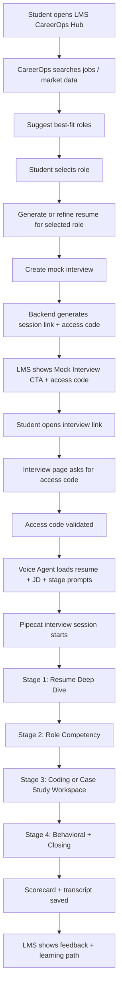
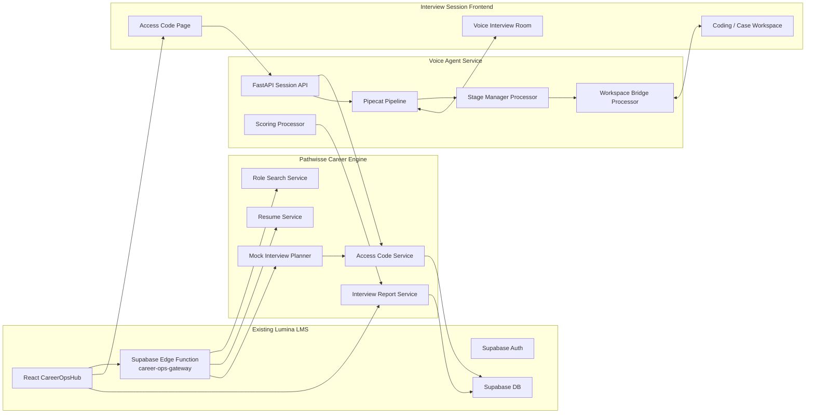
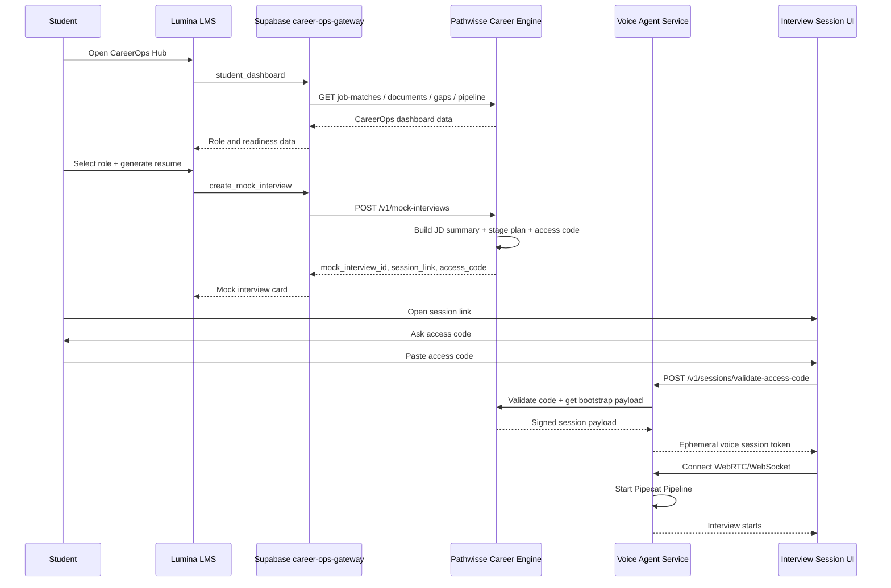
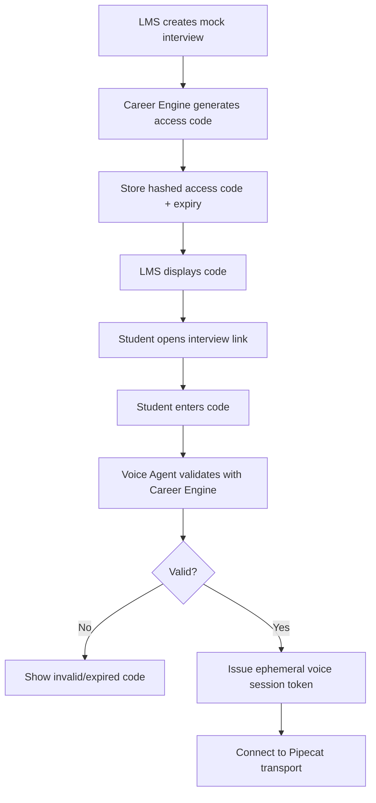
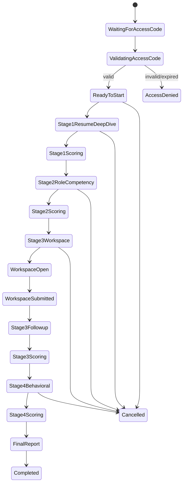
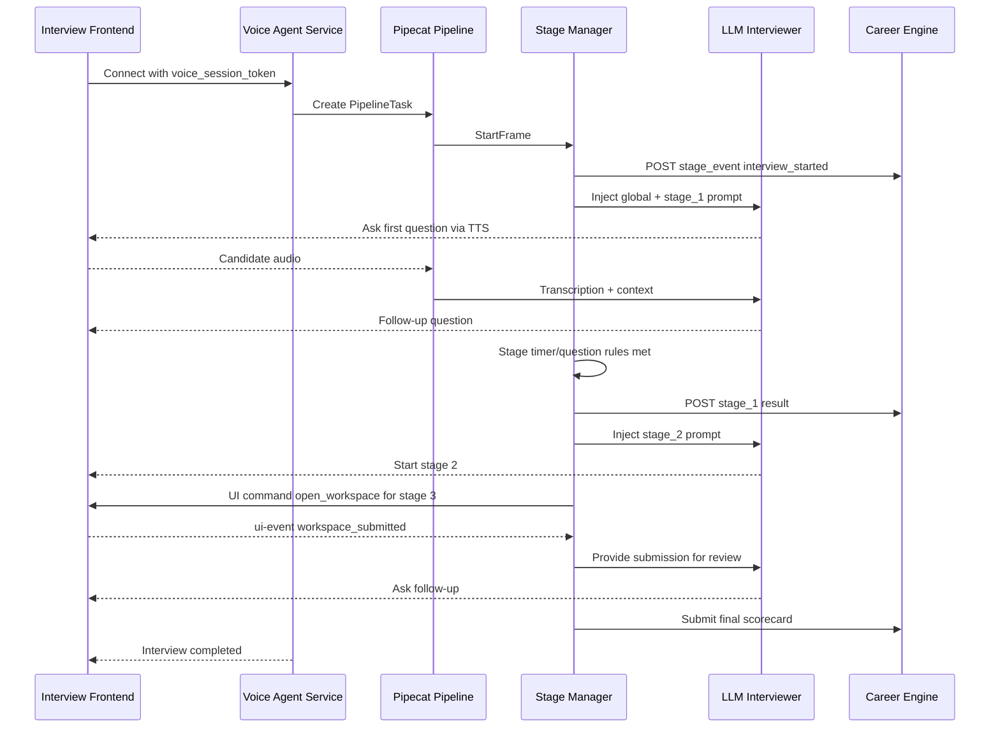

# Voice Agent Architecture for Lumina LMS + Pathwisse CareerOps Mock Interview

**Audience:** LMS frontend/backend developers, CareerOps backend developers, voice-agent developers  
**Purpose:** Define how to design a stage-based mock interview voice agent using `pipecat-ai/pipecat`, integrated with `lumina-learning-hub` and the future `pathwisse-career-engine`.

---

## 1. Current repo context

### 1.1 Lumina Learning Hub

`lumina-learning-hub` is the existing LMS application. It is a React + Vite + TypeScript frontend using Supabase, TanStack Query, React Router, Tailwind, shadcn/ui, and Supabase Edge Functions.

The current app already has a student CareerOps route:

```txt
/dashboard/career-ops
```

The app route is wired in `src/App.tsx`, and the student hub component is `src/pages/dashboard/CareerOpsHub.tsx`.

The CareerOps hub currently shows:

- lifecycle stage
- readiness score
- activation state
- integration status
- job matches count
- mock interview score
- actions to activate CareerOps and sync profile

The hook `src/hooks/useCareerOps.ts` calls the Supabase Edge Function named:

```txt
career-ops-gateway
```

Current supported gateway actions include:

```txt
student_dashboard
activate_student
sync_profile
instructor_dashboard
management_dashboard
```

The existing Supabase Edge Function also already calls remote CareerOps endpoints such as:

```txt
/v1/students/{studentId}/pipeline
/v1/students/{studentId}/job-matches
/v1/students/{studentId}/documents
/v1/students/{studentId}/gaps
/v1/activations
/v1/students/{studentId}/sync
```

### 1.2 Pathwisse Career Engine

`pathwisse-career-engine` exists as a repository but is currently empty. Treat it as the new service that should own:

- internet/job-source search
- role recommendations
- resume generation/refinement
- job description summarization
- interview plan generation
- mock interview records
- access code generation
- scorecards
- feedback
- learning path recommendations after interview

### 1.3 Pipecat

`pipecat-ai/pipecat` should be used as the live interview runtime, not as the LMS or CareerOps backend.

It should own:

- live voice session
- agent turn-taking
- STT/LLM/TTS orchestration
- stage transitions
- frontend UI commands
- transcript streaming
- coding/case-study stage bridge
- runtime metrics
- interruption handling
- session cleanup

---

## 2. High-level product flow



---

## 3. Service boundaries

### 3.1 Lumina LMS

**Responsibilities**

- user authentication
- student dashboard
- CareerOps hub UI
- access code display
- mock interview launch CTA
- final feedback UI
- instructor/admin visibility
- Supabase integration

**Should not own**

- live Pipecat session
- LLM interview orchestration
- job crawling/search
- stage-prompt generation

### 3.2 Pathwisse Career Engine

**Responsibilities**

- aggregate learner profile from LMS
- search internet/job sources
- suggest roles
- store role-fit rationale
- generate/refine resume
- summarize JD
- generate interview plan
- create mock interview record
- generate access code
- issue voice-agent session bootstrap payload
- store transcript, scores, feedback
- recommend next learning path

### 3.3 Voice Agent Service

**Responsibilities**

- validate session token from backend
- receive stage-wise interview payload
- start Pipecat pipeline
- run stage manager
- send frontend UI commands
- receive frontend UI events
- call scoring/report APIs
- end session safely

Recommended stack:

```txt
Python
FastAPI
pipecat-ai
Redis or Postgres for short-lived session state
WebRTC or WebSocket transport
LLM provider
STT provider
TTS provider
```

### 3.4 Interview Frontend Session

Can be part of Lumina or a separate app/subdomain.

**Responsibilities**

- show access-code form
- validate code
- connect to voice agent
- audio/video controls
- transcript
- stage progress
- timer
- coding editor
- case-study editor
- submit workspace output
- show final report link

---

## 4. Proposed deployment architecture



---

## 5. Recommended domain model

### 5.1 Mock interview

```json
{
  "id": "mock_iv_01J...",
  "tenant_id": "org_123",
  "student_id": "user_456",
  "career_ops_user_id": "co_user_789",
  "selected_role_id": "role_123",
  "resume_id": "resume_123",
  "job_description_id": "jd_123",
  "status": "created",
  "session_link": "https://interview.pathwisse.com/mock/mock_iv_01J...",
  "access_code_hash": "argon2_hash",
  "access_code_expires_at": "2026-05-13T18:30:00Z",
  "created_at": "2026-05-13T17:30:00Z"
}
```

### 5.2 Interview attempt

```json
{
  "id": "attempt_01J...",
  "mock_interview_id": "mock_iv_01J...",
  "student_id": "user_456",
  "status": "waiting_for_access_code",
  "started_at": null,
  "ended_at": null,
  "current_stage_id": null,
  "voice_agent_session_id": null,
  "transcript_url": null,
  "scorecard": null
}
```

### 5.3 Stage result

```json
{
  "stage_id": "stage_2",
  "stage_name": "Role Competency",
  "started_at": "2026-05-13T17:40:00Z",
  "ended_at": "2026-05-13T17:49:30Z",
  "score": 74,
  "rubric_scores": {
    "clarity": 4,
    "role_knowledge": 3,
    "evidence": 4,
    "communication": 4
  },
  "strengths": ["Clear structure", "Good resume linkage"],
  "improvements": ["Needs stronger metrics"],
  "transcript_segment_id": "seg_123"
}
```

---

## 6. End-to-end backend flow



---

## 7. API design

### 7.1 LMS/Supabase gateway to Career Engine

Add new actions to `career-ops-gateway`.

Current action union should be extended:

```ts
type GatewayAction =
  | "student_dashboard"
  | "activate_student"
  | "sync_profile"
  | "instructor_dashboard"
  | "management_dashboard"
  | "search_roles"
  | "select_role"
  | "generate_resume"
  | "create_mock_interview"
  | "get_mock_interview"
  | "list_mock_interviews"
  | "get_interview_report";
```

### 7.2 Create mock interview

**Endpoint**

```http
POST /v1/mock-interviews
```

**Called by**

```txt
Lumina Supabase Edge Function -> Pathwisse Career Engine
```

**Request**

```json
{
  "tenant_id": "org_123",
  "student_id": "user_456",
  "career_ops_user_id": "co_user_789",
  "selected_role": {
    "role_id": "role_123",
    "title": "Frontend Developer",
    "seniority": "Junior",
    "fit_score": 86,
    "fit_rationale": [
      "Strong React learning history",
      "Good TypeScript progress",
      "Needs more testing experience"
    ]
  },
  "resume": {
    "resume_id": "resume_123",
    "version": 3,
    "source": "generated_by_career_ops",
    "text": "Full resume text or signed document URL"
  },
  "job": {
    "job_description_id": "jd_123",
    "source_url": "https://example.com/job",
    "title": "Junior Frontend Developer",
    "company": "ExampleCo",
    "summary": "Build React UI, integrate REST APIs, write tests...",
    "required_skills": ["React", "TypeScript", "CSS", "REST", "Testing"],
    "nice_to_have_skills": ["GraphQL", "Accessibility", "Design systems"]
  },
  "preferences": {
    "interview_mode": "voice_plus_workspace",
    "difficulty": "adaptive",
    "include_coding_stage": true,
    "target_duration_minutes": 40
  }
}
```

**Response**

```json
{
  "success": true,
  "data": {
    "mock_interview_id": "mock_iv_01J...",
    "session_link": "https://interview.pathwisse.com/mock/mock_iv_01J...",
    "access_code": "LUMA-4829",
    "access_code_expires_at": "2026-05-13T18:30:00Z",
    "status": "created",
    "stages_preview": [
      {
        "stage_id": "stage_1",
        "title": "Resume Deep Dive",
        "duration_seconds": 480
      },
      {
        "stage_id": "stage_2",
        "title": "Frontend Role Competency",
        "duration_seconds": 600
      },
      {
        "stage_id": "stage_3",
        "title": "Coding Exercise",
        "duration_seconds": 900
      },
      {
        "stage_id": "stage_4",
        "title": "Behavioral + Closing",
        "duration_seconds": 480
      }
    ]
  }
}
```

---

## 8. Access code flow

### 8.1 Important security rule

The visible access code should **not** be the actual Pipecat session token.

Use this pattern:

```txt
Access code = short human-entered code
Voice session token = short-lived machine token issued after validation
```

### 8.2 Flow



### 8.3 Validate access code

**Endpoint**

```http
POST /v1/voice-agent/sessions/validate-access-code
```

This can live in the Voice Agent Service, but it should call Career Engine for final validation.

**Request**

```json
{
  "mock_interview_id": "mock_iv_01J...",
  "access_code": "LUMA-4829",
  "client": {
    "timezone": "Asia/Kolkata",
    "browser": "Chrome",
    "audio_supported": true,
    "workspace_supported": true
  }
}
```

**Response**

```json
{
  "success": true,
  "data": {
    "voice_session_token": "vst_eyJhbGciOi...",
    "voice_session_id": "voice_sess_01J...",
    "transport": {
      "type": "webrtc",
      "join_url": "wss://voice.pathwisse.com/rtvi/voice_sess_01J...",
      "expires_at": "2026-05-13T18:45:00Z"
    }
  }
}
```

---

## 9. Backend to Voice Agent bootstrap payload

This is the most important payload.

When the student validates the access code, the Voice Agent Service needs a complete session bootstrap payload from Career Engine.

### 9.1 Payload shape

```json
{
  "schema_version": "mock_interview_bootstrap.v1",
  "request_id": "req_01J...",
  "tenant": {
    "tenant_id": "org_123",
    "name": "Lumina Demo College"
  },
  "student": {
    "student_id": "user_456",
    "full_name": "Mahammad Wahab",
    "email": "student@example.com",
    "timezone": "Asia/Kolkata",
    "lifecycle_stage": "career_ready",
    "career_readiness_score": 78
  },
  "mock_interview": {
    "mock_interview_id": "mock_iv_01J...",
    "attempt_id": "attempt_01J...",
    "selected_role_id": "role_123",
    "status": "ready_to_start",
    "target_duration_seconds": 2460,
    "language": "en",
    "mode": "voice_plus_workspace"
  },
  "role": {
    "title": "Junior Frontend Developer",
    "seniority": "Junior",
    "role_family": "Software Engineering",
    "fit_score": 86,
    "fit_summary": "Best fit due to React, TypeScript, and frontend coursework."
  },
  "resume": {
    "resume_id": "resume_123",
    "version": 3,
    "summary": "Student has React, TypeScript, dashboard UI, and LMS project experience.",
    "full_text": "Full resume text here...",
    "skills": ["React", "TypeScript", "Tailwind", "Supabase", "REST APIs"],
    "projects": [
      {
        "name": "Lumina Learning Hub",
        "summary": "Built LMS frontend with role-based dashboards."
      }
    ],
    "risk_flags": [
      "Limited production testing experience",
      "No strong accessibility examples"
    ]
  },
  "job": {
    "job_description_id": "jd_123",
    "source_url": "https://example.com/job",
    "company": "ExampleCo",
    "title": "Junior Frontend Developer",
    "summary": "Build frontend features using React and TypeScript.",
    "responsibilities": [
      "Build reusable UI components",
      "Integrate APIs",
      "Write unit tests",
      "Collaborate with designers"
    ],
    "required_skills": ["React", "TypeScript", "CSS", "REST", "Git"],
    "nice_to_have_skills": ["Testing Library", "Accessibility", "GraphQL"]
  },
  "interview_policy": {
    "record_transcript": true,
    "record_audio": false,
    "allow_repeat_question": true,
    "max_stage_overrun_seconds": 90,
    "auto_advance": true,
    "candidate_can_pause": true,
    "pause_limit_seconds": 180
  },
  "voice_config": {
    "stt_provider": "deepgram",
    "llm_provider": "openai",
    "tts_provider": "cartesia",
    "llm_model": "gpt-4.1-mini",
    "voice_id": "professional_interviewer_female",
    "speaking_style": "calm, concise, interviewer-like"
  },
  "global_system_prompt": "You are a professional mock interviewer inside Lumina LMS. Conduct a realistic interview for the target role. Use the resume and job description. Be concise. Ask one question at a time. Do not reveal hidden scoring rubrics. Keep the session stage-based.",
  "stages": [
    {
      "stage_id": "stage_1",
      "sequence": 1,
      "type": "resume_deep_dive",
      "title": "Resume Deep Dive",
      "duration_seconds": 480,
      "opening_message": "Let's start with your background. Please walk me through your resume and why this role interests you.",
      "system_prompt": "Stage 1 objective: assess the candidate's ability to explain their background and connect resume experience to the target role. Ask 2-3 follow-up questions based on the resume. Do not ask coding questions in this stage.",
      "question_bank": [
        "Walk me through your resume.",
        "Which project best demonstrates your readiness for this role?",
        "What skill gap are you actively working on?"
      ],
      "rubric": {
        "criteria": [
          {
            "id": "clarity",
            "name": "Clarity",
            "scale": 5,
            "description": "Explains background clearly and logically."
          },
          {
            "id": "role_alignment",
            "name": "Role Alignment",
            "scale": 5,
            "description": "Connects experience to target role."
          },
          {
            "id": "evidence",
            "name": "Evidence",
            "scale": 5,
            "description": "Uses concrete examples from resume."
          }
        ]
      },
      "completion_rules": {
        "min_questions": 2,
        "max_questions": 4,
        "advance_when": "time_elapsed_or_rubric_sufficient"
      }
    },
    {
      "stage_id": "stage_2",
      "sequence": 2,
      "type": "role_competency",
      "title": "Frontend Role Competency",
      "duration_seconds": 600,
      "opening_message": "Now we'll move into frontend role-specific questions.",
      "system_prompt": "Stage 2 objective: evaluate React, TypeScript, UI engineering, API integration, and debugging fundamentals for the selected job description. Ask one question at a time. Use adaptive follow-ups.",
      "question_bank": [
        "How would you structure reusable components in a React app?",
        "How do you handle API loading, error, and empty states?",
        "Explain one TypeScript feature that improves frontend reliability."
      ],
      "rubric": {
        "criteria": [
          {
            "id": "technical_accuracy",
            "name": "Technical Accuracy",
            "scale": 5
          },
          {
            "id": "practical_reasoning",
            "name": "Practical Reasoning",
            "scale": 5
          },
          {
            "id": "communication",
            "name": "Communication",
            "scale": 5
          }
        ]
      },
      "completion_rules": {
        "min_questions": 3,
        "max_questions": 5,
        "advance_when": "time_elapsed_or_enough_signal"
      }
    },
    {
      "stage_id": "stage_3",
      "sequence": 3,
      "type": "coding_or_case",
      "title": "Coding Exercise",
      "duration_seconds": 900,
      "opening_message": "Next, I will open a coding workspace. Solve the task and explain your approach as you work.",
      "system_prompt": "Stage 3 objective: assess applied problem-solving. Send an open_workspace UI command. After submission, review the solution, ask one follow-up, then score.",
      "workspace": {
        "workspace_type": "coding",
        "language": "typescript",
        "starter_code": "function groupByStatus(items: Array<{ id: string; status: string }>) {\n  // TODO\n}\n",
        "instructions": "Implement groupByStatus to return an object where keys are status values and values are arrays of items.",
        "test_cases": [
          {
            "name": "groups by status",
            "input": "[{id:'1',status:'todo'},{id:'2',status:'done'}]",
            "expected": "{ todo: [...], done: [...] }"
          }
        ],
        "submit_event": "workspace_submitted"
      },
      "rubric": {
        "criteria": [
          {
            "id": "correctness",
            "name": "Correctness",
            "scale": 5
          },
          {
            "id": "code_quality",
            "name": "Code Quality",
            "scale": 5
          },
          {
            "id": "explanation",
            "name": "Explanation",
            "scale": 5
          }
        ]
      },
      "completion_rules": {
        "requires_workspace_submission": true,
        "max_followups_after_submission": 1,
        "advance_when": "workspace_submitted_and_followup_done"
      }
    },
    {
      "stage_id": "stage_4",
      "sequence": 4,
      "type": "behavioral_closing",
      "title": "Behavioral + Closing",
      "duration_seconds": 480,
      "opening_message": "Finally, let's cover a behavioral scenario and close with feedback.",
      "system_prompt": "Stage 4 objective: evaluate collaboration, ownership, learning mindset, and role motivation. Ask 1-2 behavioral questions. Then end the interview and trigger final scoring.",
      "question_bank": [
        "Tell me about a time you received difficult feedback.",
        "How do you handle unclear requirements?",
        "Why should this company take a chance on you for this role?"
      ],
      "rubric": {
        "criteria": [
          {
            "id": "ownership",
            "name": "Ownership",
            "scale": 5
          },
          {
            "id": "reflection",
            "name": "Reflection",
            "scale": 5
          },
          {
            "id": "culture_fit",
            "name": "Culture Fit",
            "scale": 5
          }
        ]
      },
      "completion_rules": {
        "min_questions": 1,
        "max_questions": 3,
        "advance_when": "final_stage_complete"
      }
    }
  ],
  "callback_urls": {
    "stage_event": "https://career.pathwisse.com/v1/mock-interviews/mock_iv_01J.../stage-events",
    "transcript_event": "https://career.pathwisse.com/v1/mock-interviews/mock_iv_01J.../transcript-events",
    "workspace_submission": "https://career.pathwisse.com/v1/mock-interviews/mock_iv_01J.../workspace-submissions",
    "final_report": "https://career.pathwisse.com/v1/mock-interviews/mock_iv_01J.../final-report"
  },
  "security": {
    "payload_signature": "hmac_sha256...",
    "issued_at": "2026-05-13T17:30:00Z",
    "expires_at": "2026-05-13T18:45:00Z"
  }
}
```

---

## 10. Why this payload is needed

The Voice Agent Service must not guess the interview. It needs a deterministic contract.

### Required sections

| Section | Why needed |
|---|---|
| `tenant` | multi-tenant routing, callback authorization |
| `student` | personalization and identity |
| `mock_interview` | attempt/session tracking |
| `role` | target role context |
| `resume` | candidate-specific questioning |
| `job` | JD-specific questioning |
| `interview_policy` | timing and session rules |
| `voice_config` | provider/model/voice setup |
| `global_system_prompt` | shared interviewer behavior |
| `stages` | stage-wise prompts, rubrics, timing |
| `callback_urls` | persistence back to Career Engine |
| `security` | signed payload validation |

---

## 11. Pipecat voice-agent internal design

### 11.1 Recommended Python package structure

```txt
voice-agent/
  app/
    main.py
    api/
      sessions.py
      health.py
    core/
      config.py
      security.py
    career_ops/
      client.py
      schemas.py
    interview/
      schemas.py
      stage_manager.py
      prompt_builder.py
      scoring.py
      transcript.py
      workspace.py
    pipecat_runtime/
      pipeline_factory.py
      processors/
        interview_stage_manager.py
        workspace_bridge.py
        transcript_collector.py
        final_report_processor.py
```

### 11.2 Pipecat pipeline

```mermaid
flowchart LR
    A[Transport Input] --> B[RTVI Processor]
    B --> C[STT]
    C --> D[User Context Aggregator]
    D --> E[Interview Stage Manager]
    E --> F[LLM Interviewer]
    F --> G[TTS]
    G --> H[Transport Output]
    H --> I[Assistant Aggregator]
    I --> J[Transcript Collector]
    J --> K[Scorecard Processor]
```



A practical Pipecat pipeline can look like this conceptually:

```python
pipeline = Pipeline([
    rtvi,
    transport.input(),
    stt,
    user_aggregator,
    interview_stage_manager,
    llm,
    tts,
    transport.output(),
    assistant_aggregator,
    transcript_collector,
    scorecard_processor,
])
```

The exact ordering may vary by chosen transport and whether RTVI is added manually or by `PipelineTask`, but this is the conceptual runtime.

---

## 12. Custom processors

### 12.1 InterviewStageManagerProcessor

**Purpose**

Controls the interview state machine.

**Responsibilities**

- load bootstrap payload
- set current stage
- inject stage prompt into LLM context
- start timers
- track question count
- trigger stage transitions
- open frontend workspace for stage 3
- receive workspace submission
- summarize stage result
- call final report generation

**State**

```json
{
  "current_stage_id": "stage_2",
  "stage_started_at": "2026-05-13T17:40:00Z",
  "question_count": 3,
  "workspace_opened": false,
  "workspace_submitted": false,
  "stage_scores": {}
}
```

### 12.2 WorkspaceBridgeProcessor

**Purpose**

Bridge Pipecat and frontend for coding/case-study UI.

**Sends to frontend**

```json
{
  "command": "open_workspace",
  "payload": {
    "stage_id": "stage_3",
    "workspace_type": "coding",
    "language": "typescript",
    "instructions": "Implement groupByStatus...",
    "starter_code": "...",
    "timer_seconds": 900
  }
}
```

**Receives from frontend**

```json
{
  "event": "workspace_submitted",
  "payload": {
    "stage_id": "stage_3",
    "workspace_type": "coding",
    "code": "function groupByStatus(...) { ... }",
    "language": "typescript",
    "elapsed_seconds": 682,
    "run_results": {
      "passed": 4,
      "failed": 1,
      "logs": []
    }
  }
}
```

Pipecat RTVI frames support this because custom UI commands and inbound UI events are available.

### 12.3 TranscriptCollectorProcessor

**Purpose**

Persist transcript segments.

**Segment payload**

```json
{
  "mock_interview_id": "mock_iv_01J...",
  "attempt_id": "attempt_01J...",
  "stage_id": "stage_1",
  "speaker": "candidate",
  "text": "I started with React...",
  "timestamp": "2026-05-13T17:34:00Z",
  "final": true
}
```

### 12.4 ScorecardProcessor

**Purpose**

Convert stage transcript + rubric into scores.

**Output**

```json
{
  "stage_id": "stage_1",
  "score": 78,
  "rubric_scores": {
    "clarity": 4,
    "role_alignment": 4,
    "evidence": 3
  },
  "feedback": {
    "strengths": ["Clear resume walkthrough"],
    "improvements": ["Add more measurable outcomes"]
  }
}
```

---

## 13. Stage state machine



---

## 14. Stage prompt strategy

Use three prompt layers:

```txt
1. Global interviewer prompt
2. Stage-specific system prompt
3. Dynamic context prompt
```

### 14.1 Global interviewer prompt

```txt
You are a professional mock interviewer inside Lumina LMS.
You are interviewing the candidate for the selected role.
Use the resume and job description as grounding.
Ask one question at a time.
Be concise and realistic.
Do not reveal hidden rubrics or scoring rules.
Respect the current stage.
Do not skip stages unless instructed by the stage manager.
When the candidate asks for clarification, provide it without giving away the answer.
```

### 14.2 Stage prompt template

```txt
Current stage: {{stage.title}}
Stage objective: {{stage.objective}}
Time limit: {{stage.duration_seconds}} seconds
Role: {{role.title}}
Job summary: {{job.summary}}
Resume summary: {{resume.summary}}
Known gaps: {{resume.risk_flags}}

Rules:
- Ask only questions relevant to this stage.
- Ask one question at a time.
- Use adaptive follow-ups.
- Stop after stage completion rules are met.
- Do not provide final feedback until the closing stage.
```

### 14.3 Stage 3 coding/case prompt

```txt
This is the coding/case-study stage.
First, tell the candidate that a workspace will open.
Then emit a UI command to open the workspace.
Do not solve the task for the candidate.
While the candidate works, answer clarifying questions only.
After the candidate submits, review the submission.
Ask one follow-up question about their approach.
Then produce a hidden stage evaluation.
```

---

## 15. Frontend UI command contracts

### 15.1 Open coding workspace

```json
{
  "type": "ui-command",
  "data": {
    "command": "open_workspace",
    "payload": {
      "stage_id": "stage_3",
      "workspace_type": "coding",
      "language": "typescript",
      "title": "Coding Exercise",
      "instructions": "Implement groupByStatus...",
      "starter_code": "function groupByStatus(...) {\n  // TODO\n}",
      "timer_seconds": 900,
      "submission_required": true
    }
  }
}
```

### 15.2 Open case-study workspace

```json
{
  "type": "ui-command",
  "data": {
    "command": "open_workspace",
    "payload": {
      "stage_id": "stage_3",
      "workspace_type": "case_study",
      "title": "Product Case Study",
      "prompt": "Improve activation for a learning app.",
      "sections": [
        "Problem understanding",
        "Assumptions",
        "User segments",
        "Metrics",
        "Solution",
        "Tradeoffs"
      ],
      "timer_seconds": 900,
      "submission_required": true
    }
  }
}
```

### 15.3 Frontend workspace submission event

```json
{
  "type": "ui-event",
  "data": {
    "event": "workspace_submitted",
    "payload": {
      "stage_id": "stage_3",
      "workspace_type": "case_study",
      "answer_markdown": "My approach...",
      "elapsed_seconds": 812
    }
  }
}
```

### 15.4 Stage progress update

```json
{
  "type": "ui-command",
  "data": {
    "command": "stage_progress",
    "payload": {
      "current_stage_id": "stage_2",
      "current_stage_title": "Role Competency",
      "stage_sequence": 2,
      "total_stages": 4,
      "remaining_seconds": 420
    }
  }
}
```

---

## 16. Interview runtime flow



---

## 17. Final report payload

When the interview ends, Voice Agent or Career Engine should generate this:

```json
{
  "mock_interview_id": "mock_iv_01J...",
  "attempt_id": "attempt_01J...",
  "student_id": "user_456",
  "selected_role": "Junior Frontend Developer",
  "overall_score": 76,
  "recommendation": "ready_with_minor_gaps",
  "summary": "Candidate shows strong React fundamentals and good communication but needs stronger testing and accessibility examples.",
  "stage_results": [
    {
      "stage_id": "stage_1",
      "title": "Resume Deep Dive",
      "score": 80,
      "feedback": "Clear background explanation."
    },
    {
      "stage_id": "stage_2",
      "title": "Frontend Role Competency",
      "score": 72,
      "feedback": "Understands React patterns but testing answers were shallow."
    },
    {
      "stage_id": "stage_3",
      "title": "Coding Exercise",
      "score": 74,
      "feedback": "Solution mostly correct; edge cases need improvement."
    },
    {
      "stage_id": "stage_4",
      "title": "Behavioral + Closing",
      "score": 78,
      "feedback": "Good reflection and ownership."
    }
  ],
  "skill_gaps": [
    {
      "skill": "Frontend testing",
      "severity": "medium",
      "recommended_learning_path_id": "lp_testing_101"
    },
    {
      "skill": "Accessibility",
      "severity": "medium",
      "recommended_learning_path_id": "lp_a11y_101"
    }
  ],
  "next_actions": [
    "Complete Testing Library module",
    "Practice one accessibility case",
    "Retake frontend mock interview in 7 days"
  ],
  "transcript_url": "https://career.pathwisse.com/reports/mock_iv_01J/transcript"
}
```

---

## 18. Data storage recommendation

### In Lumina Supabase

Keep lightweight mirror fields:

```txt
profiles.mock_interview_score
career_ops_accounts.readiness_state
career_ops_sync_jobs
career_ops lifecycle analytics
```

### In Pathwisse Career Engine

Own detailed interview data:

```txt
mock_interviews
mock_interview_attempts
mock_interview_stages
mock_interview_transcripts
workspace_submissions
mock_interview_scorecards
career_recommendations
role_matches
resumes
job_descriptions
```

### Why

Lumina should stay LMS-first. Career Engine should own employability intelligence and interview history.

---

## 19. Recommended backend APIs for Career Engine

```txt
GET    /v1/students/{studentId}/job-matches
POST   /v1/students/{studentId}/selected-role
POST   /v1/students/{studentId}/resumes
POST   /v1/mock-interviews
GET    /v1/mock-interviews/{mockInterviewId}
POST   /v1/mock-interviews/{mockInterviewId}/validate-access-code
POST   /v1/mock-interviews/{mockInterviewId}/bootstrap
POST   /v1/mock-interviews/{mockInterviewId}/stage-events
POST   /v1/mock-interviews/{mockInterviewId}/transcript-events
POST   /v1/mock-interviews/{mockInterviewId}/workspace-submissions
POST   /v1/mock-interviews/{mockInterviewId}/final-report
GET    /v1/mock-interviews/{mockInterviewId}/report
```

---

## 20. MVP implementation plan

### Phase 1: Mock interview creation

- Extend `career-ops-gateway` with `create_mock_interview`.
- Build `POST /v1/mock-interviews` in Pathwisse Career Engine.
- Store mock interview, access code hash, session link.
- Display mock interview card in `CareerOpsHub`.

### Phase 2: Interview session page

- Add route such as:

```txt
/interview/:mockInterviewId
```

or separate app:

```txt
https://interview.pathwisse.com/mock/:mockInterviewId
```

- Show access-code input.
- Validate access code.
- Receive ephemeral voice session token.

### Phase 3: Basic Pipecat voice interview

- Build Voice Agent Service.
- Start Pipecat session from bootstrap payload.
- Implement 4-stage state manager.
- Support transcript and final report.

### Phase 4: Workspace stage

- Implement `open_workspace` UI command.
- Add coding/case frontend component.
- Send `workspace_submitted` event.
- Score workspace submission.

### Phase 5: LMS feedback loop

- Save final report.
- Update `mock_interview_score`.
- Show skill gaps and recommended learning path inside LMS.

---

## 21. Developer checklist

### Lumina LMS

- [ ] Add mock interview CTA to CareerOpsHub.
- [ ] Add mock interview card/list.
- [ ] Add access code display.
- [ ] Add interview launch link.
- [ ] Add report summary UI.
- [ ] Extend `useCareerOps.ts` with mock interview actions.
- [ ] Extend `career-ops-gateway` action union.

### Pathwisse Career Engine

- [ ] Implement role recommendation APIs.
- [ ] Implement resume generation APIs.
- [ ] Implement mock interview planner.
- [ ] Implement access code service.
- [ ] Implement bootstrap payload endpoint.
- [ ] Implement transcript and scorecard persistence.
- [ ] Implement report generation.
- [ ] Sign payloads with HMAC.

### Voice Agent Service

- [ ] Implement FastAPI session endpoints.
- [ ] Implement Pipecat pipeline factory.
- [ ] Implement `InterviewStageManagerProcessor`.
- [ ] Implement `WorkspaceBridgeProcessor`.
- [ ] Implement transcript collector.
- [ ] Implement final report callback.
- [ ] Handle access-code validation and short-lived session tokens.
- [ ] Add metrics/logging.

### Interview Frontend

- [ ] Access-code screen.
- [ ] Voice transport connection.
- [ ] Stage progress UI.
- [ ] Transcript panel.
- [ ] Coding workspace.
- [ ] Case-study workspace.
- [ ] Submit event bridge.
- [ ] End-of-interview report redirect.

---

## 22. Practical recommendation

Do not start with full coding interviews first. Start with this MVP:

```txt
Role recommendation
→ Resume/JD based mock interview
→ 4 voice stages
→ Stage 3 as case-study text workspace
→ Final scorecard
```

Then add coding execution in the next release.

Coding execution needs sandboxing, test runners, timeout limits, dependency control, abuse prevention, and secure isolation. A case-study workspace proves the Pipecat + UI-command architecture faster and with less blast radius.

---

## 23. Summary

The best design is:

```txt
Lumina LMS = user experience + dashboard + activation + report visibility
Pathwisse Career Engine = career intelligence + interview planning + records
Voice Agent Service = Pipecat-powered live mock interview runtime
Interview Frontend = access-code entry + real-time voice + workspace
```

The backend must send the Voice Agent a complete signed bootstrap payload containing:

```txt
student
tenant
role
resume
job description
global prompt
stage-wise prompts
durations
rubrics
workspace definition
callback URLs
security metadata
```

Pipecat then runs the session as a stage-based, real-time agent using its pipeline, frame processors, RTVI frontend events, STT, LLM, and TTS.
